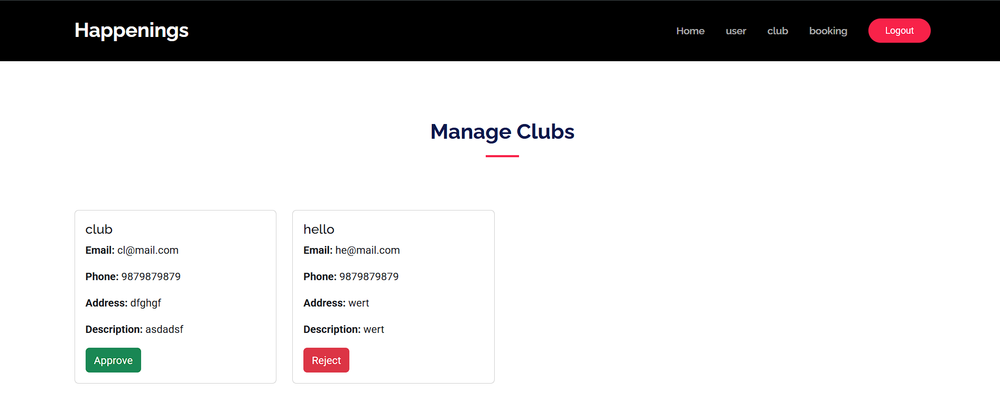

# 🎉 Happenings - Discover and Book Events Near You

**Happenings** is a full-featured Django-based web application that lets users discover and book events like concerts, DJ nights, cultural programs, and local happenings. It’s designed for 3 user roles: **Admin**, **Club**, and **Normal User**, each with dedicated functionality.

> Made with 💻 using Python, Django, and Bootstrap.

---

## 🚀 Features

### 🔐 Authentication
- User registration, login & logout
- Role-based access: Admin, Club, Normal User
- Club registration requires admin approval

### 🔍 Event Discovery
- Browse all upcoming events
- Powerful filters:
  - Search by name, place, artist, category
  - Filter by date range and price range
  - View nearest events using user location (geolocation API)

### 🎟️ Ticket Booking
- Book **Normal** or **VIP** tickets
- Dummy payment gateway simulation
- Booking history for users

### 🏢 Club Dashboard
- Add/edit/delete their events
- Set ticket count, price, event dates, artist names, and location

### 👨‍💼 Admin Dashboard
- Approve or reject club registrations
- Manage all users, clubs, and bookings
- View booking history across the platform

---

## 🛠 Tech Stack

| Category      | Technologies Used                           |
|---------------|----------------------------------------------|
| 💻 Backend     | Python 3.x, Django                          |
| 🎨 Frontend    | HTML, CSS, JavaScript, Bootstrap            |
| 🛢️ Database    | SQLite (default Django DB)                  |
| 📍 Location    | Google API                       |
| 🖼 Image Upload| Pillow (for event image handling)           |

---

## 📸 Screenshots

| Description                  | Screenshot                               |
|-----------------------------|-------------------------------------------|
| 🔹 Homepage                 |      |
| 🔹 Club Event List          |  |
| 🔹 Club Add Event Page      |  |
| 🔹 Admin Manage Users       |  |
| 🔹 Admin View Bookings      |  |

> Make sure all screenshots are saved in a `screenshots/` folder in the project root.

---

## 📦 Requirements

 install the following:

```bash
pip install django
pip install pillow
```
1. Clone the repository
   ```bash
   git clone https://github.com/your-username/happenings.git
   cd happenings
   ```
2. Create a virtual environment
  ```bash
   python -m venv venv
   source venv/bin/activate 
  ```
3. Apply migrations
    ```bash
   python manage.py makemigrations
   python manage.py migrate
    ```
3. Create a superuser
    ```bash
   python manage.py createsuperuser
    ```
5. Run the development server
    ```bash
    python manage.py runserver
    ```
